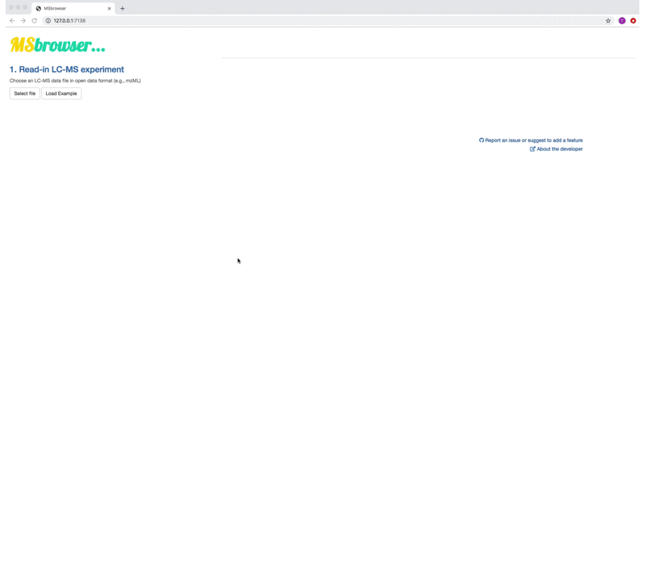

# Welcome!

[](https://travis-ci.org/rstudio/rmarkdown)
[](http://hits.dwyl.io/tkimhofer/msbrowser)
[](https://opensource.org/licenses/MIT)


**MSbrowser is web-browser-based application for parameter fine-tuning of xcms peak picking algorithms**. 


The app is designed for fast and easy parameter testing to optimise xcms peak picking performance. Different visualisations allow to gain insight into the LC-MS data structure and the effects different peak picking parameter values have on peak picking performance. 

MSbrowser is implemented in a user-friendly web-application framework that can be installed as a simple R package.




MSbrowser addresses the need to make peak picking of LC-MS data more transparent and reproducible across platforms! Key features of the app include:

- Generation of LC-MS experiment summary statistics 
- User-interactive LC-MS data visualisatons that allow gaining insight into raw MS data structure
- Parameter testing and fine-tuning for xcms peak picking algorithms (*centWave* and *matchFilter*)
- Fast and interactive visualisations of xcms peak picking results


# App installation and launch

The MSbrowser package is hosted on [GitHub](https://github.com/) and is build with [xcms](https://bioconductor.org/packages/release/bioc/html/xcms.html/) version 3.6 (or higher) to perform peak picking. The following R code can be used to install necessary R dependencies on your computer.

```R
# install dependencies from CRAN (devtools and BiocManager)
deps=c('devtools', 'BiocManager')
id=deps %in% installed.packages()[,1]
if(any(!id)) install.packages(deps[id])

# install xcms
if(!requireNamespace("xcms", versionCheck=list(op = ">=", version = "3.6"), quietly = T)){BiocManager::install('xcms')}
```

Now you're ready to go for the installation of MSbrowser:
```
# install MSbroswer
devtools::install_github('tkimhofer/msbrowser')
```
If prompted by the command line, perform necessary package updates.

MSbrowser can be launched with the following R-terminal command:

```R
msbrowser::startApp()
```
A new web-browser window opens with the **MSbrowser** user interface.


# Documentation 
MSbrowser has an intuitive workflow, with help text placed in the user interface. Basic app functionalities and an illustration of the general workflow for fine-tuning of xcms peak picking parameters can be found in this [video tutorial](https://vimeo.com/385203675/).

A Guide for *centWave* peak picking parameters can be found under the [*centWave Resources*](https://tkimhofer.github.io/msbrowser/articles/pars.html/) option in the page menu above. 

MSbrowser can read MS files in open data formats mzML, mzXML, CDF, netCDF; file conversions from vendor format can be performed with open source softwares available either as a standalone (e.g., [ProteoWizard](http://proteowizard.sourceforge.net/)) or online tool (e.g., [GNPS](https://gnps-quickstart.ucsd.edu/conversion)).

# Example Data
The application comes with HILIC-MS example data acquired from a urine sample, so that one can familiarise oneself with MSbrowser's functionalities without the need to perform any file conversion first.


# Feedback
Got questions or suggestions? Log an [issue on GitHub](https://github.com/tkimhofer/msbrowser/issues/) (requires login) or [drop me an email](mailto:torben.kimhofer@murdoch.edu.au?subject=[MSbrwoser]%20Source%20Han%20Sans)!
