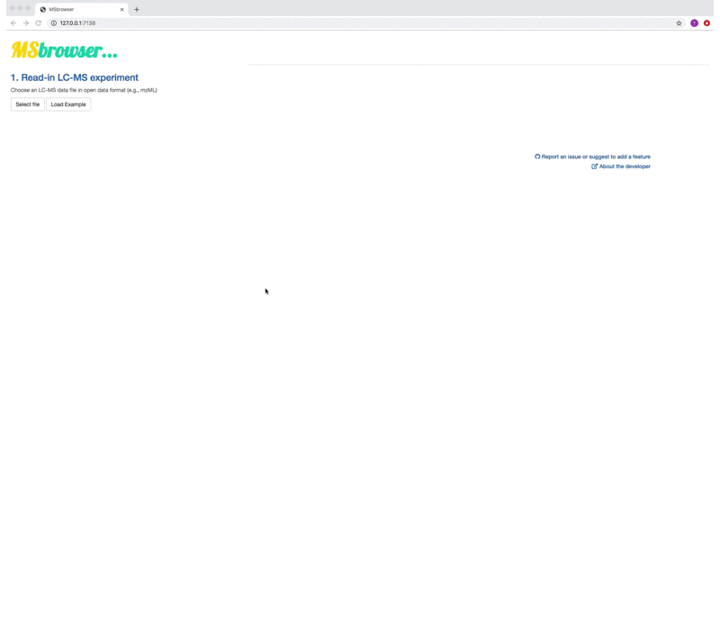

# Welcome!
<!-- badges: start -->
[](http://www.repostatus.org/#active)
[](https://opensource.org/licenses/MIT)

**MSbrowser is an R-based web-browser application for parameter fine-tuning of xcms peak picking algorithms**. 


The app is designed for fast and easy parameter testing to optimise xcms peak picking performance. Different visualisations allow to gain insight into the LC-MS data structure and the effects different peak picking parameter values have on peak picking performance. 

MSbrowser is implemented in a user-friendly web-application framework that can be installed as a simple R package. Performance was tested with Google Chrome.




MSbrowser addresses the need to make peak picking of LC-MS data more transparent and reproducible across platforms! Key features of the app include:

- Generation of LC-MS experiment summary statistics 
- User-interactive LC-MS data visualisatons that allow gaining insight into raw MS data structure
- Parameter testing and fine-tuning for xcms peak picking algorithms (*centWave* and *matchFilter*)
- Fast and interactive visualisations of xcms peak picking results


# App installation and launch

The MSbrowser package is hosted on [GitHub](https://github.com/) and is build with [xcms](https://bioconductor.org/packages/release/bioc/html/xcms.html/) version 3.6 (or higher) to perform peak picking. The following R code can be used to install necessary R dependencies on your computer.

```R
# Install missing CRAN packages
needed <- setdiff(c("devtools", "BiocManager"), installed.packages()[,"Package"])
if(length(needed)) install.packages(needed)

# Install or update xcms (>= 3.6) from Bioconductor
if(!requireNamespace("xcms", quietly=TRUE) || packageVersion("xcms") < "3.6")
  BiocManager::install("xcms")
```

Now you're ready to go for the installation of MSbrowser:
```
# Install MSBrowser from GitHub
devtools::install_github("tkimhofer/msbrowser")
```
If prompted by the command line, perform necessary package updates.

MSbrowser can be launched with the following R-terminal command:

```R
msbrowser::startApp()
```
A new web-browser window opens with the **MSbrowser** user interface.


# Documentation 
MSbrowser has an intuitive workflow, with help text placed in the user interface. Basic app functionalities and an illustration of the general workflow for fine-tuning of xcms peak picking parameters can be found in this [video tutorial](https://vimeo.com/385203675/).

A Guide for *centWave* peak picking parameters can be found under the [*centWave Resources*](https://tkimhofer.github.io/msbrowser/articles/pars.html/) option in the page menu above. 

MSbrowser can read MS files in open data formats mzML, mzXML, CDF, netCDF; file conversions from vendor format can be performed with open source softwares available either as a standalone (e.g., [ProteoWizard](http://proteowizard.sourceforge.net/)) or online tool (e.g., [GNPS](https://gnps-quickstart.ucsd.edu/conversion)).


# Example Data
The application can be tested using human urine experiment data acquired with HILIC-ESI(+)-Q-TOF-MS. This data are available in the lcmsData package which can be installed with the following R code:
```R
devtools::install_github('tkimhofer/lcmsData')
```

# Feedback
Got questions or suggestions? Log an [issue on GitHub](https://github.com/tkimhofer/msbrowser/issues/) (requires login)
