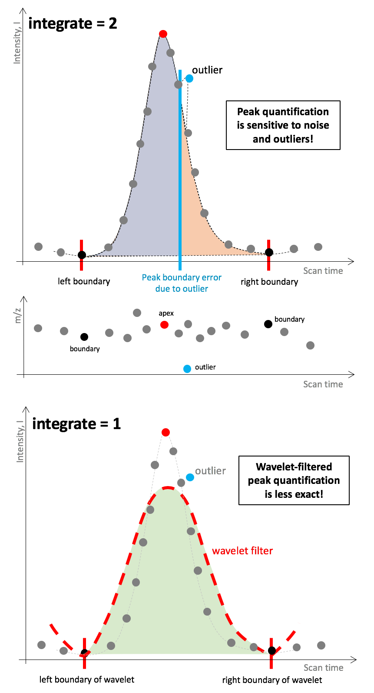

# ***centWave*** Parameters

*ppm, peakwidth, snthresh, prefilter, mzCenterFun, integrate, mzdiff, fitgauss, scanrange, noise.*  

&nbsp;

All centWave parameters require fine-tuning for each assay type and mass analyser. The following provides a short description of each parameter value and it's relevance in the *centWave* algorithm.  

&nbsp;

| Parameter | Description | Pre-adjusted value |
|-----------|-------------|:--------:|
|[ppm](#ppm-allowed-signal-deviation-in-mz-dimension)| Allowed signal deviation in m/z dimension | 25 |
|[peakwidth](#peakwidth-range-of-peak-elution-times) | Range of peak elution times (in seconds) | 20-50 s |
|[snthresh](#snthresh-threshold-of-signal-to-noise-ratio) | Threshold signal to noise ratio | 10 |
|[prefilter](#prefilter-number-of-data-points-k-exceeding-a-certain-intensity-threshold-i)| Peak definition: Number of data points (*n*) exceeding a certain intensity threshold (*I*)| *k*=3, *I*=100 |
|[mzdiff](#mzdiff-accepted-closeness-of-two-signals-in-mz-dimension)| Accepted closeness of two signals in m/z dimension |-0.001 |
|[noise](#noise-intensity-cut-off-values-below-are-not-considered)| Intensity cut-off, values below are considered as instrument noise | 0 |
|[mzCenterFun](#mzcenterfun-mz-summary-statistic-of-a-peak)| Function to calculate the m/z center of a chromatographic peak | weighted Mean (wMean)  |
|[integrate](#integrate-integration-method-for-peak-quantifiaction)| Integration method for peak quantification: 1 - Mexican hat filtered data, 2 - real data | 1  |
|[fitgauss](#integrate-integration-method-for-peak-quantifiaction)| Peak parameterisation using Gaussian distribution | FALSE |
|[scanrange](#scanrange-perform-peak-picking-in-a-specific-scan-range)| Perform peak picking in a scan range interval | numeric(0)  |

&nbsp; 

&nbsp;

&nbsp;

## ***ppm***: Allowed signal deviation in m/z dimension
This *centWave* parameter *ppm* specifies the tolerance in m/z values for defining a signal in m/z dimensions. This parameter is closely related to the mass accuracy of the mass spectrometer, which is traditionally expressed in parts per million (ppm). 

Higher *ppm* values allow more m/z value variations and lead to detection of a higher number of potential peaks - increasing false positives. Lower values can lead to missing out on many signals, since the measured mass values differ from the true mass more than expected. 

The illustration below shows a peak picking example using the same LC-MS data, where *ppm* parameter values was changed and all other centWave parameters were held constant.

&nbsp; 

&nbsp;

&nbsp;

## ***mzdiff***: Accepted closeness of two signals in m/z dimension
The *mzdiff* parameter specifies the allowed minimum distance of two co-eluting peaks in m/z dimension. An *mzdiff* value of 1 indicates that the m/z value of two signals with overalapping scan times be at least 1, in order for both signals to be included in the result peak list. 

The centWave *mzdiff* parameter can also take negative values, indicating that the same data point can be allocated to two different peaks. Assigning negative *mzdiff* values has implications for further downstream processing steps, e.g., establishing correspondence of overlapping peaks across different samples. Higher *mzdiff* parameter values lead to detecting more features (potential signals), lower values reduce the number of features detected. 

Below is an example using the same data processed with *mzdiff* values of 1 and 0.01. 

&nbsp; 

&nbsp;

&nbsp;

## ***noise***: Intensity cut-off, values below are not considered
The ion detection in most mass spectrometers is accomplished with electron multipliers. These instruments are highly sensitive and produce electronical noise, which is visible as (usually) random data points below a certain intensity cut-off. 

The noise structure of LC-MS spectra generated with mass specs of different types and from different vendors (incl. software updates) can be inherently different. Therefore, this parameter requires careful adjustment for each mass spectrometer setup. Lower values increases *centWave* computation time, higher values lead to missing out on true data signals. 

&nbsp; 

&nbsp;

&nbsp;

## ***snthresh***: Threshold of signal to noise ratio
Closely related to the noise structure is the *snthresh* parameter, allowing to set a minimal signal to noise ratio (S/N) for peaks to be detected. *snthresh* builds on an S/N estimate that defines noise intensities locally in the scan time dimension:

This S/N definition can be problematic when the noise structure is not evenly distributed across the m/z dimension. The example below shows that higher intensity signals are discarded with higher *snthresh* values, most likely due to noisy and high intensity data points in proximity to the signal's m/z trace. The final peak list using a high *snthresh* parameter value contains signals of low intensities, which is somewhat unexpected.

&nbsp; 

&nbsp;

&nbsp;

## ***peakwidth***: Range of peak elution times
The *peakwidth* parameter allows specification of the minimal and maximal peak elution time (in seconds). Setting the minimal elution time to higher values risks missing out small signals (usually of low intensity). However, the literature suggest a minimum number of six data points in order to quantify a peak reliably. Therefore, the optimal minimal *peakwidth* parameter is related to the number of scans on MS 1 level (this is a user-defined setting of the mass spectrometer). 

The example below shows the results of *centWave* peak picking performed with different *peakwidth* parameter values and where all other parameters were held constant. 

An unexpected algorithm behaviour was observed when setting the minimal elution time to a value of 1, which resulted in peak splitting of a coherent signal which was not split with higher *peakwidth* values. 

&nbsp; 

&nbsp;

&nbsp;

## ***prefilter***: Number of data points (*k*) exceeding a certain intensity threshold (*I*)
The *prefilter* parameter is similar to the *noise* parameter, but instead of specifying an intensity cut-off, it specifies a minimal number of data points (*k*) that exceed a certain intensity value (*I*). A signal is discarded if it is represented by less than *k* consecutive data points of intensity *I*.

Lower *prefilter* parameter values perform less filtering of signals with low intensity / scan time, and therefore, reduce computation time. The values of this parameter strongly depend on the characteristics of well-behavied LC-MS signals. This parameter should not be set to stringent as it can lead to discarding true positive signals.

&nbsp; 

&nbsp;

&nbsp;

## ***mzCenterFun***: m/z summary statistic of a peak
In the final LC-MS feature table, each feature is characterised by a scan time and m/z value. The latter represents a summary statistic of all data points defining a feature, where each one has a slightly different m/z value (see also *ppm* parameter). The *mzCenterFun* parameter specifies the m/z summary statistic of a feature. In practice, the different *mzCenterFun* options have very little impact.

&nbsp; 

&nbsp;

&nbsp;

## ***integrate***: Integration method for peak quantification
Signal quantification is performed by integrating the area under a peak. The *integrate* function specifies if the non-transformed data should be used for peak integration or if a wavelet-transform filtered data should be used (upper and lower panel, respectively, in the plot below). The former is sensitive to outliers and noise, since *centWave* defines left and right peak boundaries through change in slope (see Figure below). The latter is less sensitive to noise, however, the wavelet-filtered data is less exact and can lead to signal mis-representations.

&nbsp; 

&nbsp;

&nbsp;

## ***scanrange***: Perform peak picking in a specific scan range
The *scanrange* parameter allows to select a scan time interval for peak picking of the entire m/z range. Spectral data outside the specified interval are not considered for peak picking. This parameter is usually not specified in untargeted metabolic profiling studies. The *scanrange* parameter takes scan ID values (it is not specified in seconds).

