# centWave Parameters

*ppm, peakwidth, snthresh, prefilter, mzCenterFun, integrate, mzdiff,
fitgauss, scanrange, noise.*

 

Feature detection with `xcms` requires assay- and instrument-specific
parameter tuning. The sections below summarise the role of each
parameter in the `centWave` algorithm and provide practical guidance for
choosing sensible starting values.

 

| Parameter | Description | Suggested starting value |
|----|----|:--:|
| [ppm](#ppm-allowed-signal-deviation-in-the-mz-dimension) | Allowed signal deviation in the m/z dimension | 25 |
| [peakwidth](#peakwidth-range-of-peak-elution-times) | Expected range of chromatographic peak widths (seconds) | 3-15 s |
| [snthresh](#snthresh-signal-to-noise-threshold) | Minimum signal-to-noise ratio | 2 |
| [prefilter](#prefilter-minimum-number-of-points-above-an-intensity-threshold) | Minimum number of points above a defined intensity threshold | *k*=3, *I*=100 |
| [mzdiff](#mzdiff-minimum-mz-separation-of-overlapping-peaks) | Minimum m/z separation for overlapping peaks | 0.001 |
| [noise](#noise-intensity-cut-off-for-low-level-signals) | Intensity threshold below which signals are ignored | 75th percentile |
| [mzCenterFun](#mzcenterfun-summary-function-for-peak-mz) | Function used to calculate the peak m/z value | `wMean` |
| [integrate](#integrate-method-used-for-peak-integration) | Method used for peak integration | 1 |
| [fitgauss](#fitgauss-gaussian-fitting-of-peaks) | Whether to fit a Gaussian peak model | `FALSE` |
| [scanrange](#scanrange-restrict-peak-picking-to-a-scan-interval) | Restrict peak picking to a scan interval | `numeric(0)` |

 

 

 

## ***ppm***: Allowed signal deviation in m/z dimension

This *centWave* parameter *ppm* specifies the tolerance in m/z values
for defining a signal in m/z dimension. This parameter is closely
related to the mass accuracy of the mass spectrometer, which is
traditionally expressed in parts per million (ppm).

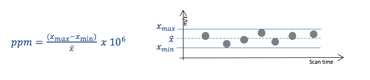

Higher *ppm* values allow greater variability in m/z and usually
increase the number of detected features, but they may also increase the
number of false positives. Lower values can lead to missing signals,
since the measured mass values may deviate from the true mass more than
expected (this is common).

The illustration below shows a peak picking example using the same LC-MS
data, where *ppm* parameter value was varied while all other centWave
parameters were held constant.

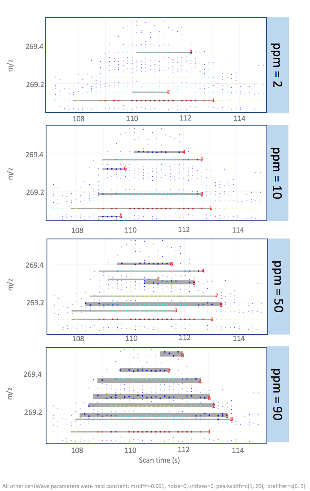

 

 

 

## ***mzdiff***: Accepted closeness of two signals in m/z dimension

The *mzdiff* parameter specifies the allowed minimum distance of two
co-eluting peaks in m/z dimension. An *mzdiff* value of 1 indicates that
the m/z value of two signals with overlapping scan time (=retention
time) be at least 1 m/z, in order for both signals to be included in the
result peak list.

The centWave *mzdiff* parameter can also take negative values,
indicating that the same data point can be allocated to two different
peaks. Assigning negative *mzdiff* values has implications for further
downstream processing steps, e.g., establishing correspondence of
overlapping peaks across different samples.

Below is an example using the same data processed with *mzdiff* values
of 1 and 0.01.

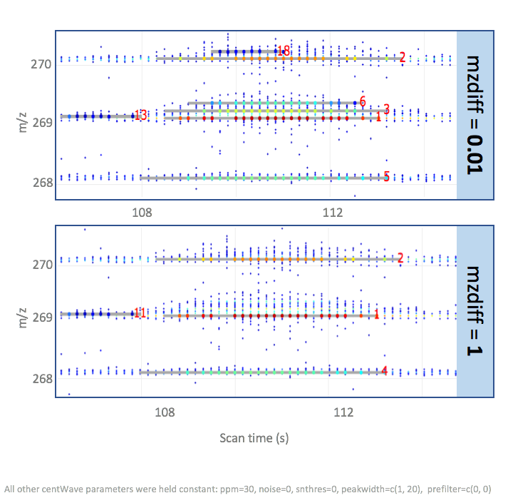

 

 

 

## ***noise***: Intensity cut-off, values below are not considered

In many mass spectrometers, ion detection is based on
electron-multiplier or related detector technologies. These instruments
are highly sensitive and produce electronic noise, which is visible as
(usually) random data points below a certain intensity cut-off.

The noise structure of LC-MS spectra generated with mass specs of
different types and from different vendors (incl. software updates) can
be inherently different, with mz-value dependent noise intensities.
Therefore, this parameter requires careful adjustment for each mass
spectrometer setup. Lower values increase *centWave* computation time,
higher values lead to missing out true ion signals.

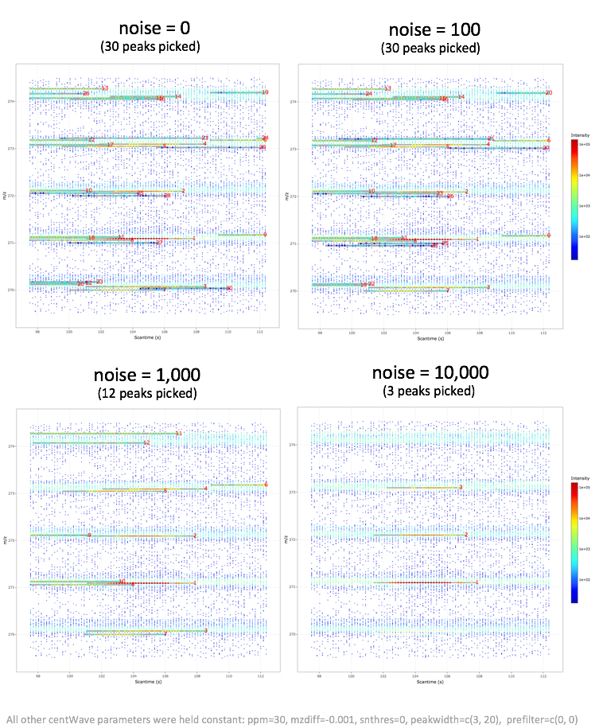

 

 

 

## ***snthresh***: Threshold of signal to noise ratio

Closely related to the noise structure is the *snthresh* parameter,
allowing to set a minimal signal to noise ratio (S/N) for peaks to be
detected. *snthresh* builds on an S/N estimate that defines noise
intensities locally in the scan time dimension:

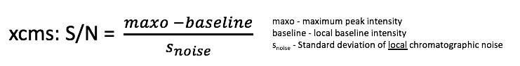

This local S/N definition can be problematic when noise is not
homogeneous across the m/z dimension. The example below shows that
higher intensity signals are discarded with higher *snthresh* values,
likely because nearby high-intensity noise points inflate the local
noise estimate around the signal trace. The final peak list using a high
*snthresh* parameter value contains signals of low intensities, which is
somewhat unexpected. **UPDATE: THIS BEHAVIOUR IS ONLY OBSERVED WHEN
CENTWAVE FUNCTION IS PARAMETERISED WITH THE SCANRANGE ARGUMENT (such as
in MSbrowser).**

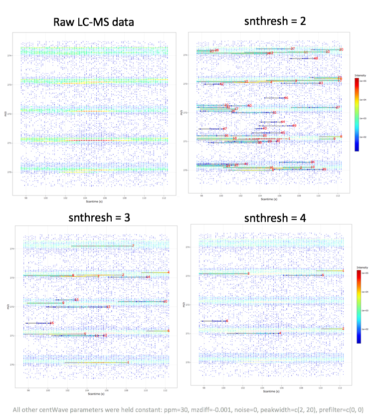

 

 

 

## ***peakwidth***: Range of peak elution times

The *peakwidth* parameter specifies the minimum and maximum peak elution
time in seconds. The optimal *peakwidth* parameter values are related to
the MS1 scan rate. Literature suggests a minimum number of six data
points per peak in order to obtain reliable peak quantifications.
Example: If a low intensity compound elutes over 1s, then the number of
instrument scans should be at least 6 per second.

Increasing the lower bound or decreasing the upper bound of *peakwidth*
makes peak detection more restrictive and can reduce the number of
detected features, especially for peaks with unusually short or long
elution profiles. To find optimal *peakwidth* parameter values, it is
useful to visually inspect elution times for high and low intensity ions
in different spectral regions.

The example below shows the results of *centWave* peak picking performed
with different *peakwidth* parameter values and where all other
parameters were held constant.

An unexpected algorithm behaviour was observed when setting the minimal
elution time to a value of 1, which resulted in peak splitting of a
coherent signal which was not split with higher *peakwidth* values.

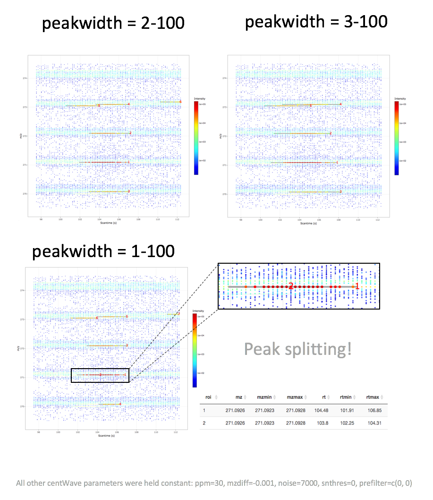

 

 

 

## ***prefilter***: Number of data points (*k*) exceeding a certain intensity threshold (*I*)

The *prefilter* parameter is similar to the *noise* parameter, but
instead of specifying an intensity cut-off, it specifies a minimal
number of data points (*k*) that exceed a certain intensity value (*I*).
A signal is discarded if it is represented by less than *k* consecutive
data points of intensity *I*.

Lower *prefilter* values are less stringent and allow more low-intensity
candidate signals to pass the initial filter, which can increase
computation time. Literature suggests a minimum number of six data
points per peak in order to obtain reliable peak quantifications (then
also depending on the scan frequency)

The values of this parameter strongly depend on the characteristics of
well-behaved LC-MS signals. This parameter should not be set too
stringently as it can lead to discarding true positive signals.

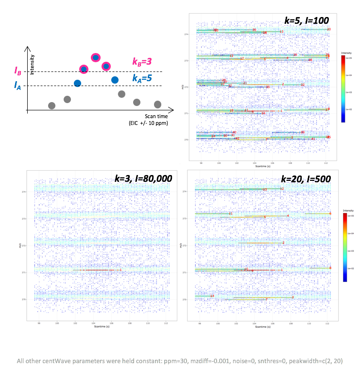

 

 

 

## ***mzCenterFun***: m/z summary statistic of a peak

In the final LC-MS feature table, each feature is characterised by a
scan time and m/z value. The latter represents a summary statistic of
all data points defining a feature, where each one has a slightly
different m/z value (see also *ppm* parameter). The *mzCenterFun*
parameter specifies the m/z summary statistic of a feature. In practice,
the different *mzCenterFun* options have very little impact.

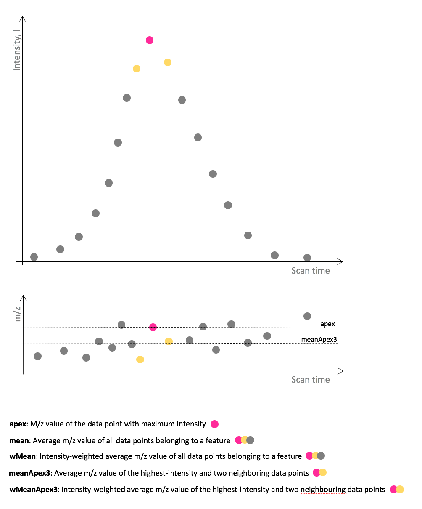

 

 

 

## ***integrate***: Integration method for peak quantification

The *integrate* parameter specifies whether peak boundaries and
integration are based on the original data (1) or on the
wavelet-transformed signal (2) (upper and lower panel, respectively, in
the plot below). The former is sensitive to outliers and noise, since
*centWave* defines left and right peak boundaries through change in
slope (see Figure below). The latter is less sensitive to noise,
however, the wavelet-filtered data is less exact and can lead to signal
mis-representations.

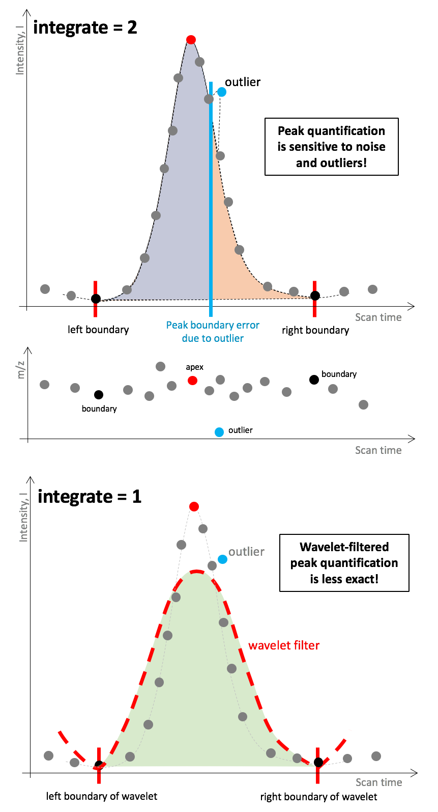

 

 

 

## ***fitgauss***: Peak parameterisation using Gaussian distribution

A Gaussian function resembles a characteristic symmetric “bell curve”
shape, which is often described as a normal distribution. If this
*centWave* parameter option is set to TRUE, a Gaussian is fitted to each
feature. According to the *xcms* documentation, this parametric fit
mainly affects the estimated retention-time position of the peak.

 

 

 

## ***scanrange***: Perform peak picking in a specific scan range

The *scanrange* parameter allows to define a reduced scan/retention time
interval for which peak picking will be performed over the entire m/z
range. Spectral data outside this scan time interval are not considered.
Parameter *scanrange* is specified in scan indices rather than seconds.

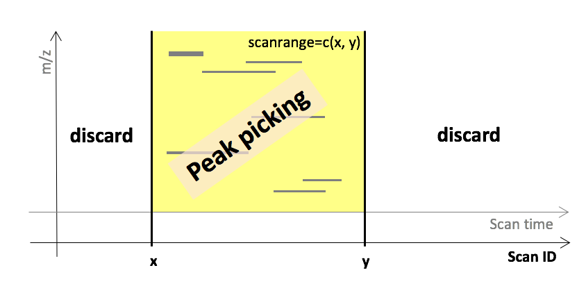
