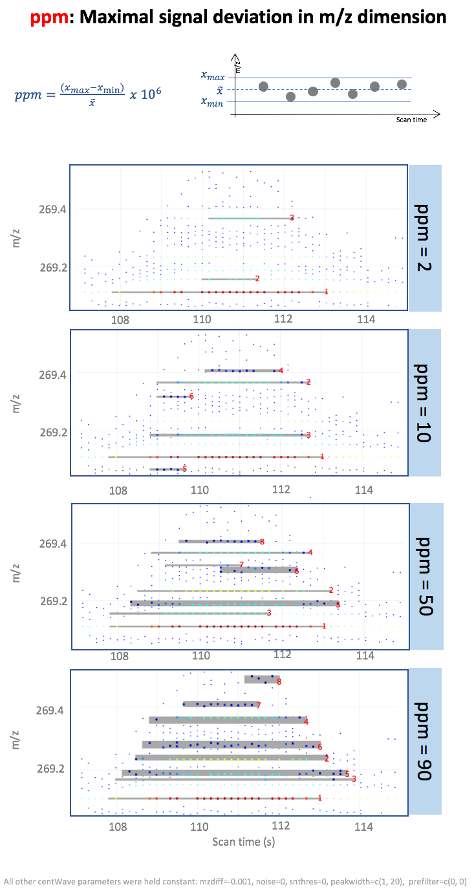
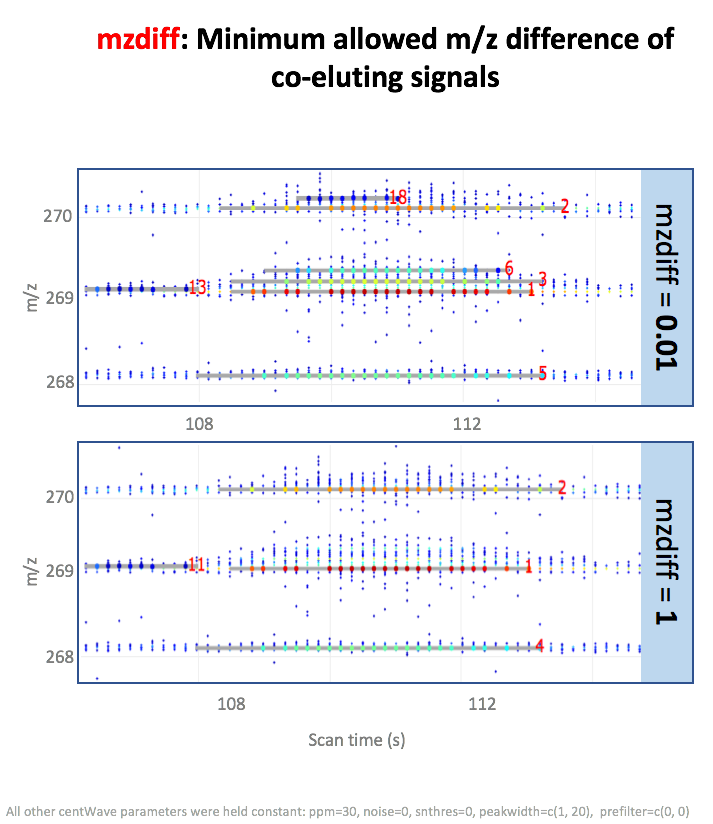
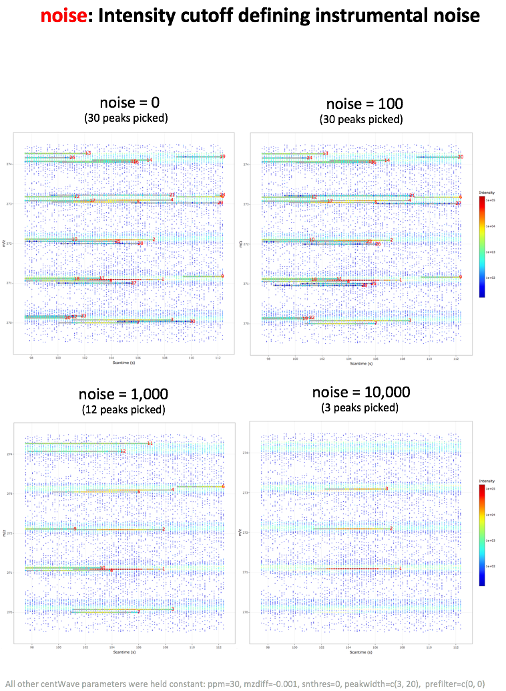
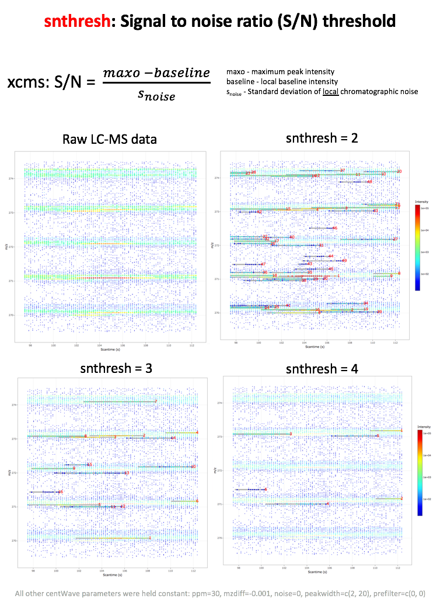
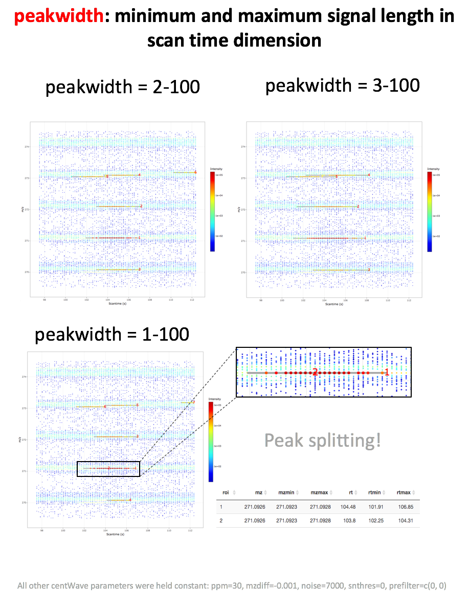
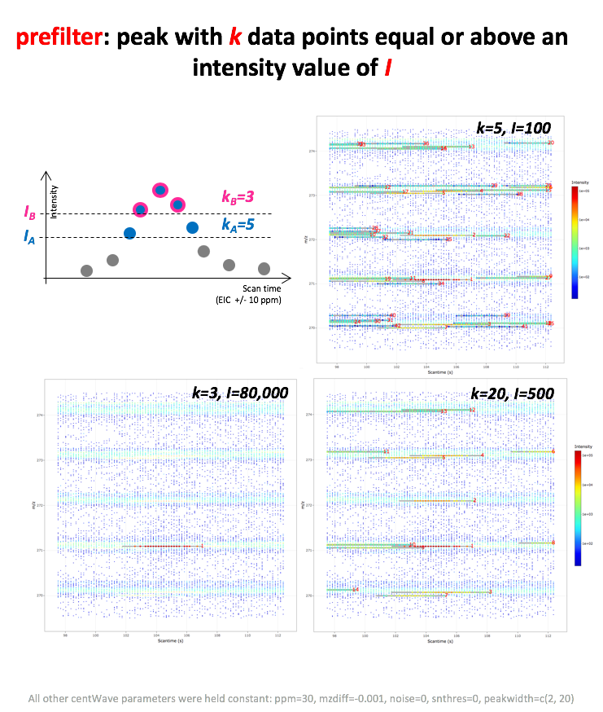

# centWave Parameters

*ppm, peakwidth, snthresh, prefilter, mzCenterFun, integrate, mzdiff, fitgauss, scanrange, noise.*  

All centWave parameters require fine-tuning for each assay type and mass analyser. 

The following illustrates all xcms parameters.  

Explanation of parameters:

| Parameter | Explanation | Pre-adjusted value |
|-----------|-------------|:--------:|
|[ppm](#ppm)| signal deviation in m/z dimension| 25 |
|[peakwidht](#peakwidth) | range peak elution times in seconds | 20-50 s |
|[snthresh](#snthresh) | signals below this locally defined value are not considered as signals| 10 |
|[prefilter](#prefilter)| Peak definition: how many data points (*n*) should be above a certain intensity threshold (*I*)| *k*=3, *I*=100 |
|[mzdiff](#mzdiff)| Closeness of two signals in mz dimension |-0.001 |
|[noise](#noise)| Intensity threshold, values below are considered instrument noise | 0 |
|integrate| Integration method: 1 - Mexican hat filtered data (less exact), 2- real data (prone to noise)| 1  |
|mzCenterFun| Function to calculate m/z center of chromatographic peak | weighted Mean (wMean)  |
|fitgauss| Peak fitting using Gauss distribution| FALSE |

## ppm

## mzdiff

## noise

## snthresh

## peakwidth

## prefilter

